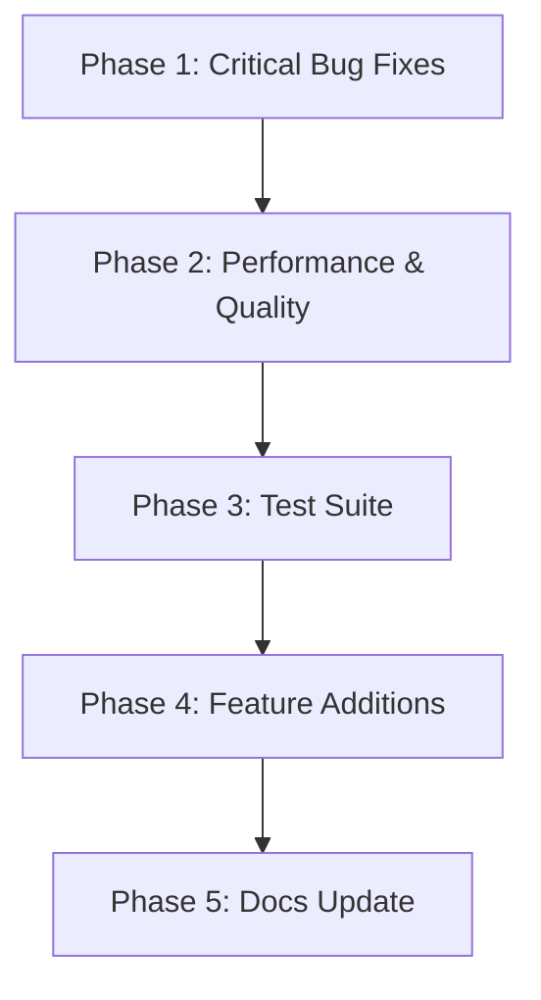

# MoneyPrinterV2 — Full Evaluation, Fix Plan & Stand-Up Guide

---

## 1. Executive Summary

MoneyPrinterV2 (MPV2) is a Python 3.12 CLI automation suite with four revenue-generating modules:

| Module | What it does |
|---|---|
| YouTube Shorts Automater | Generates AI-scripted, AI-imaged, TTS-narrated Shorts and uploads via Selenium |
| Twitter Bot | Generates and posts LLM-written tweets via Selenium |
| Affiliate Marketing | Scrapes Amazon product info, generates a pitch, posts to Twitter |
| Outreach | Scrapes Google Maps for local businesses, extracts emails, sends cold outreach |

The codebase is well-structured and modular. However, there are **critical bugs**, **incomplete features**, **security gaps**, **performance issues**, and **missing tests** that must be addressed before the project can be considered production-ready.

---

## 2. Full Evaluation

### 2.1 Architecture & Structure

**Strengths**
- Clean separation of concerns: `src/classes/` for providers, `src/` for shared utilities.
- `config.py` centralises all config reads.
- `cache.py` provides a simple JSON-based persistence layer.
- `llm_provider.py` cleanly wraps Ollama.
- `scripts/` provides bootstrap, preflight, and upload helpers.

**Weaknesses**
- `src/main.py` is a 484-line monolith with deeply nested `if/elif` chains — hard to extend.
- `src/config.py` re-opens and re-parses `config.json` on **every single call** (30+ functions). This is a significant I/O waste and a race-condition risk.
- `ROOT_DIR` is computed as `os.path.dirname(sys.path[0])` in `config.py` — this is fragile and breaks when the module is imported from a different working directory (e.g., `cron.py` called via `subprocess`).
- Wildcard imports (`from cache import *`, `from utils import *`, etc.) pollute namespaces and make dependency tracing difficult.
- `src/` modules are imported without a package prefix (e.g., `from cache import *`), which only works because `src/` is the CWD at runtime — this breaks if the project is ever packaged or run from a different directory.

---

### 2.2 Critical Bugs

| # | File | Issue | Severity |
|---|---|---|---|
| B1 | `src/config.py:8` | `ROOT_DIR = os.path.dirname(sys.path[0])` — `sys.path[0]` is the script directory, so `dirname` goes one level up. Works when run from `src/`, but breaks when `cron.py` is invoked via `subprocess` from `main.py` because the subprocess inherits a different `sys.path[0]`. | Critical |
| B2 | `src/classes/YouTube.py:851` | Bare `except:` in `upload_video()` silently swallows all exceptions and returns `False` with no logging. Impossible to debug upload failures. | High |
| B3 | `src/main.py:139,282,401,426` | Recursive `main()` calls on invalid input — can cause unbounded recursion / stack overflow on repeated bad input. | High |
| B4 | `src/classes/YouTube.py:563` | `req_dur = max_duration / len(self.images)` — crashes with `ZeroDivisionError` if no images were generated (e.g., Gemini API key missing). | High |
| B5 | `scripts/upload_video.sh:34` | `$PYTHON src/cron.py youtube $id` — does not pass the required third argument (model name), so `cron.py` will always exit with "No Ollama model specified." | High |
| B6 | `src/classes/YouTube.py:865` | `get_videos()` creates a cache file with `{"videos": []}` but the rest of the code expects `{"accounts": [...]}` structure — returns empty list silently instead of the account's videos. | High |
| B7 | `src/classes/Twitter.py:192` | `add_post()` appends the post twice: once via `posts.append(post)` (unused list) and once via `account["posts"].append(post)` inside the file read. The list mutation is a no-op but the intent is confusing. | Medium |
| B8 | `src/constants.py:49` | `YOUTUBE_RADIO_BUTTON_XPATH = "//*[@id=\"radioLabel\"]"` — selects ALL elements with that ID; `upload_video()` uses index `[2]` which is fragile and will break if YouTube changes its DOM. | Medium |
| B9 | `src/classes/Outreach.py:278` | `open(message_body, "r")` — opens the file relative to CWD, not relative to ROOT_DIR. Will fail unless the user runs the app from the project root. | Medium |
| B10 | `src/main.py:196,327` | `command = ["python", cron_script_path, ...]` — uses `python` (not `python3` or the venv interpreter), which may resolve to Python 2 on some systems. | Medium |

---

### 2.3 Incomplete / Stub Features

| # | File | Issue |
|---|---|---|
| I1 | `src/utils.py:10` | `DEFAULT_SONG_ARCHIVE_URLS = []` — empty list means if `zip_url` is not configured, `fetch_songs()` raises `RuntimeError` and the app cannot start. No fallback songs are bundled. |
| I2 | `src/classes/YouTube.py:231` | `n_prompts = len(self.script) / 3` — divides character count by 3, producing a float (e.g., 400 chars → 133 prompts). Should be `max(3, len(self.script.split('.')) )` or similar. |
| I3 | `src/constants.py:37-42` | `YOUTUBE_CRON_OPTIONS` lists "Thrice a day" but `main.py` only handles `user_input == 1` and `user_input == 2` for YouTube CRON — option 3 falls through to `break`. |
| I4 | `src/classes/AFM.py:105` | `features = self.browser.find_elements(By.ID, AMAZON_FEATURE_BULLETS_ID)` — `find_elements` returns a list of WebElements; passing raw WebElement objects to the LLM prompt produces `[<selenium...>]` strings, not actual feature text. `.text` is never extracted. |
| I5 | `docs/YouTube.md:26` | Roadmap item "Subtitles for Shorts" is listed as incomplete, but subtitles ARE implemented. Docs are stale. |
| I6 | `src/classes/YouTube.py` | `generate_video()` has no retry logic if image generation fails for one prompt — silently produces a video with fewer images. |
| I7 | `scripts/setup_local.sh:51-52` | Sets `image_provider` and `llm_provider` keys in config, but `config.py` never reads `image_provider` or `llm_provider` — these keys are dead config. |

---

### 2.4 Security Issues

| # | File | Issue |
|---|---|---|
| S1 | `src/classes/Outreach.py:77-83` | `requests.get(zip_link)` with no timeout — can hang indefinitely. |
| S2 | `src/classes/Outreach.py:178` | `requests.get(website)` with no timeout — can hang indefinitely per business. |
| S3 | `src/classes/Outreach.py:277-279` | `open(message_body, "r")` — no validation that `message_body` path is within the project directory; could read arbitrary files. |
| S4 | `config.example.json:33` | `imagemagick_path` default value is a human-readable instruction string, not a path — will cause MoviePy to fail with a confusing error. |
| S5 | `src/config.py` | No schema validation on `config.json` — missing keys cause `KeyError` with no helpful message. |
| S6 | `src/classes/AFM.py:73-77` | URL validation is done but only checks scheme/netloc — does not prevent SSRF to internal network addresses. |

---

### 2.5 Performance Issues

| # | File | Issue |
|---|---|---|
| P1 | `src/config.py` | Every config getter opens, reads, and parses `config.json` from disk. With 30+ getters called repeatedly during video generation, this is ~100+ file reads per run. Should load once and cache. |
| P2 | `src/classes/YouTube.py:524-528` | `WhisperModel` is instantiated fresh every time `generate_subtitles_local_whisper()` is called — model loading takes 5-30 seconds. Should be a singleton or passed in. |
| P3 | `src/classes/YouTube.py:582-616` | Image clips are looped until `tot_dur >= max_duration` — if there are few images and long audio, the same images repeat many times. No cap on total clip count. |
| P4 | `src/classes/YouTube.py:95,65` | `GeckoDriverManager().install()` is called in `__init__` — downloads/checks geckodriver on every instantiation. Should be cached. |
| P5 | `src/main.py:160` | `TTS()` (which loads the KittenTTS model) is instantiated inside the `while True` loop on every iteration — model reloads on every menu cycle. |

---

### 2.6 Code Quality Issues

| # | File | Issue |
|---|---|---|
| Q1 | `src/main.py` | 484-line monolith with deeply nested conditionals. Should be refactored into handler functions per module. |
| Q2 | `src/classes/YouTube.py:566` | Lambda assigned to variable (`generator = lambda txt: ...`) — should be a named function per PEP 8. |
| Q3 | `src/classes/YouTube.py:586` | `clip.duration = req_dur` — direct attribute assignment on MoviePy clip; should use `clip.set_duration(req_dur)`. |
| Q4 | `src/config.py:8` | `ROOT_DIR` computed at module import time using `sys.path[0]` — fragile. Should use `Path(__file__).resolve().parent.parent`. |
| Q5 | Multiple files | `from module import *` wildcard imports throughout — should use explicit imports. |
| Q6 | `src/classes/Outreach.py:32` | `self.go_installed = os.system("go version") == 0` — `os.system` prints to stdout and is not the right tool; use `subprocess.run` with `capture_output=True`. |
| Q7 | `src/main.py:198,329` | `def job():` defined inside a loop — closure captures `command` by reference, which is fine here but is a subtle pattern that could cause bugs if the loop variable changes. |
| Q8 | `src/classes/YouTube.py:747` | `time.sleep(10)` hardcoded — should use explicit WebDriverWait conditions. |

---

### 2.7 Missing Tests

- Zero automated tests exist.
- No unit tests for config parsing, cache operations, LLM provider, or utility functions.
- No integration tests for the Selenium flows.
- `preflight_local.py` is the only validation, and it only checks connectivity.

---

## 3. Recommended Fixes (Prioritised)

### Priority 1 — Blockers (must fix before any use)

1. **Fix `ROOT_DIR`** in `src/config.py` — change to `Path(__file__).resolve().parent.parent`.
2. **Fix `upload_video.sh`** — pass the model name as the third argument to `cron.py`.
3. **Fix `ZeroDivisionError`** in `YouTube.combine()` — guard against empty `self.images`.
4. **Fix `get_videos()` cache structure** — align the initial JSON structure with `{"accounts": []}`.
5. **Fix bare `except:`** in `upload_video()` — replace with `except Exception as e: error(str(e))`.
6. **Fix `n_prompts` calculation** — use sentence count, not character count.
7. **Fix AFM feature extraction** — call `.text` on each WebElement before passing to LLM.

### Priority 2 — High Impact Improvements

8. **Config singleton** — load `config.json` once at startup into a module-level dict; all getters read from that dict.
9. **Fix recursive `main()` calls** — replace with loops or `continue` statements.
10. **Fix `python` → `sys.executable`** in subprocess calls in `main.py`.
11. **Add `zip_url` fallback** — bundle a small set of royalty-free songs or document clearly that `zip_url` is required.
12. **Fix YouTube CRON option 3** — implement "Thrice a day" for YouTube (currently only Twitter has it).
13. **Add request timeouts** to all `requests.get()` calls in `Outreach.py`.
14. **Fix `message_body` path** — resolve relative to `ROOT_DIR`.

### Priority 3 — Quality & Completeness

15. **Refactor `main.py`** — extract each menu branch into a dedicated handler function.
16. **Replace wildcard imports** with explicit imports.
17. **Add `WhisperModel` singleton** — load once, reuse.
18. **Move `TTS()` instantiation** outside the `while True` loop.
19. **Replace `time.sleep()` in upload** with `WebDriverWait` conditions.
20. **Update `docs/YouTube.md`** — mark subtitles as implemented.
21. **Update `docs/Roadmap.md`** — mark subtitles as done.
22. **Add config schema validation** — validate required keys at startup with helpful error messages.
23. **Write unit tests** for `cache.py`, `config.py`, `llm_provider.py`, `utils.py`.

### Priority 4 — Additions from Roadmap

24. **"Create a Short based on long-form content"** — add a new YouTube option to accept a URL/text and generate a Short from it.
25. **Automated Cold Calling** — integrate Twilio or similar for voice outreach.
26. **Item Flipping module** — scrape eBay/StockX for arbitrage opportunities.

---

## 4. Stand-Up Guide (Complete Product)

This section describes the exact steps to stand up a fully working MPV2 instance from scratch.

### 4.1 Prerequisites

| Requirement | Notes |
|---|---|
| Python 3.12 | `python3 --version` must show 3.12.x |
| Firefox browser | Latest stable |
| ImageMagick | `sudo apt install imagemagick` (Linux) or download from imagemagick.org |
| Ollama | Install from ollama.ai; pull at least one model |
| Go 1.21+ | Only needed for Outreach module |
| Gemini API key | Free tier available at aistudio.google.com |
| Gmail App Password | For Outreach email sending (2FA must be enabled) |

### 4.2 Step-by-Step Setup

```
Step 1 — Clone & Bootstrap
──────────────────────────
git clone https://github.com/FujiwaraChoki/MoneyPrinterV2.git
cd MoneyPrinterV2
bash scripts/setup_local.sh
```

`setup_local.sh` will:
- Copy `config.example.json` → `config.json` (if not present)
- Create `venv/` and install all Python dependencies
- Auto-detect ImageMagick path and Firefox profile
- Auto-select an installed Ollama model
- Run `preflight_local.py` to validate the environment

```
Step 2 — Configure config.json
───────────────────────────────
```

Open `config.json` and fill in:

| Key | What to set |
|---|---|
| `firefox_profile` | Full path to your Firefox profile directory (the one logged into YouTube/Twitter) |
| `nanobanana2_api_key` | Your Gemini API key (or set `GEMINI_API_KEY` env var) |
| `zip_url` | URL to a ZIP of MP3/WAV background music files |
| `ollama_model` | Name of your pulled Ollama model (e.g. `llama3.2:3b`) |
| `imagemagick_path` | Path to `convert` binary (e.g. `/usr/bin/convert`) |
| `email.username` | Your Gmail address |
| `email.password` | Your Gmail App Password |
| `google_maps_scraper_niche` | Business niche to scrape (e.g. `plumbers in New York`) |
| `outreach_message_body_file` | Path to your HTML email template |

```
Step 3 — Validate Setup
────────────────────────
source venv/bin/activate
python3 scripts/preflight_local.py
```

All checks should show `[OK]`. Fix any `[FAIL]` items before proceeding.

```
Step 4 — Pull an Ollama Model (if not done)
────────────────────────────────────────────
ollama pull llama3.2:3b
```

```
Step 5 — Run the App
─────────────────────
source venv/bin/activate
python3 src/main.py
```

### 4.3 Module-Specific Setup

#### YouTube Shorts Automater
1. Log into YouTube in Firefox using the profile at `firefox_profile`.
2. In the app, select **1. YouTube Shorts Automation**.
3. Create an account (give it a nickname, niche, language).
4. Select **1. Upload Short** to generate and upload immediately.
5. Select **3. Setup CRON Job** to automate uploads.

#### Twitter Bot
1. Log into X (Twitter) in the same Firefox profile.
2. Select **2. Twitter Bot**.
3. Create an account (nickname, topic).
4. Select **1. Post something** to post immediately.
5. Select **3. Setup CRON Job** to automate posting.

#### Affiliate Marketing
1. Ensure a Twitter account is configured (step above).
2. Select **3. Affiliate Marketing**.
3. Enter an Amazon affiliate link and the Twitter account UUID.
4. The app will scrape the product, generate a pitch, and post it.

#### Outreach
1. Install Go: `sudo apt install golang-go`
2. Set `google_maps_scraper_niche` in `config.json`.
3. Create `outreach_message.html` with your email template.
4. Select **4. Outreach** — the app will download/build the scraper, run it, and send emails.

#### Script-Based Upload (no interactive menu)
```bash
bash scripts/upload_video.sh
```
> **Note:** After applying fix B5, this script will prompt for account ID and model name, then run the full generate+upload pipeline headlessly.

### 4.4 CRON Job Automation (Persistent)

The in-app CRON scheduler only runs while `main.py` is running. For true background automation:

```bash
# Add to system crontab (crontab -e)
# Post to Twitter twice a day
0 10,16 * * * cd /path/to/MoneyPrinterV2 && source venv/bin/activate && python3 src/cron.py twitter <ACCOUNT_UUID> <MODEL_NAME>

# Upload YouTube Short once a day
0 9 * * * cd /path/to/MoneyPrinterV2 && source venv/bin/activate && python3 src/cron.py youtube <ACCOUNT_UUID> <MODEL_NAME>
```

### 4.5 Environment Variables

```bash
export GEMINI_API_KEY="your_gemini_key"   # Alternative to nanobanana2_api_key in config
```

---

## 5. Implementation Plan (Ordered by Priority)



### Phase 1 — Critical Bug Fixes

- [ ] Fix `ROOT_DIR` in `src/config.py` using `Path(__file__).resolve().parent.parent`
- [ ] Fix `upload_video.sh` to pass model name as third arg to `cron.py`
- [ ] Guard `YouTube.combine()` against empty `self.images` list
- [ ] Fix `get_videos()` initial cache structure to use `{"accounts": []}`
- [ ] Replace bare `except:` in `upload_video()` with `except Exception as e`
- [ ] Fix `n_prompts` to use sentence count not character count
- [ ] Fix AFM `features` extraction to call `.text` on each WebElement
- [ ] Fix `message_body` path resolution in `Outreach.start()` to use `ROOT_DIR`
- [ ] Fix `python` → `sys.executable` in subprocess calls in `main.py`
- [ ] Add request timeouts to all `requests.get()` calls in `Outreach.py`

### Phase 2 — Performance & Quality

- [ ] Implement config singleton — load `config.json` once, cache in module-level dict
- [ ] Replace recursive `main()` calls with `continue` in the `while True` loop
- [ ] Add `WhisperModel` singleton to avoid reloading on every subtitle generation
- [ ] Move `TTS()` instantiation outside the `while True` loop in `main.py`
- [ ] Replace `time.sleep()` in `upload_video()` with `WebDriverWait` conditions
- [ ] Implement YouTube CRON "Thrice a day" option (currently only Twitter has it)
- [ ] Replace wildcard imports with explicit imports across all modules
- [ ] Refactor `main.py` into handler functions per module
- [ ] Add config schema validation at startup

### Phase 3 — Test Suite

- [ ] Create `tests/` directory
- [ ] Write `tests/test_cache.py` — unit tests for all cache CRUD operations
- [ ] Write `tests/test_config.py` — unit tests for all config getters
- [ ] Write `tests/test_llm_provider.py` — mock Ollama, test `generate_text()`
- [ ] Write `tests/test_utils.py` — test `rem_temp_files()`, `choose_random_song()`
- [ ] Write `tests/test_preflight.py` — test preflight checks with mocked HTTP

### Phase 4 — Feature Additions (Roadmap)

- [ ] Add "Create Short from long-form content" option to YouTube module
- [ ] Add fade-in/fade-out transitions between image clips in `combine()`
- [ ] Add retry logic in `generate_video()` if image generation fails for a prompt
- [ ] Add `--dry-run` flag to `cron.py` for testing without posting

### Phase 5 — Documentation Update

- [ ] Update `docs/YouTube.md` — mark subtitles as implemented, update config keys
- [ ] Update `docs/Roadmap.md` — mark subtitles as done
- [ ] Update `docs/Configuration.md` — remove dead `image_provider`/`llm_provider` keys
- [ ] Add `docs/Outreach.md` — document the full outreach flow
- [ ] Add `docs/Setup.md` — consolidate the stand-up guide from this document

---

## 6. File-by-File Change Summary

| File | Changes Needed |
|---|---|
| `src/config.py` | Fix `ROOT_DIR`; implement config singleton |
| `src/main.py` | Fix recursive calls; fix `python` → `sys.executable`; move `TTS()` out of loop; refactor into handler functions |
| `src/classes/YouTube.py` | Fix `combine()` zero-division; fix `get_videos()` cache structure; fix bare `except:`; fix `n_prompts`; add `WhisperModel` singleton; replace `time.sleep()` with waits |
| `src/classes/AFM.py` | Fix feature `.text` extraction |
| `src/classes/Outreach.py` | Add request timeouts; fix `message_body` path; fix `os.system` → `subprocess` |
| `scripts/upload_video.sh` | Pass model name as third argument |
| `src/constants.py` | Add YouTube CRON option 3 handling note |
| `docs/YouTube.md` | Update stale content |
| `docs/Roadmap.md` | Mark subtitles done |
| `tests/` | Create full test suite |
